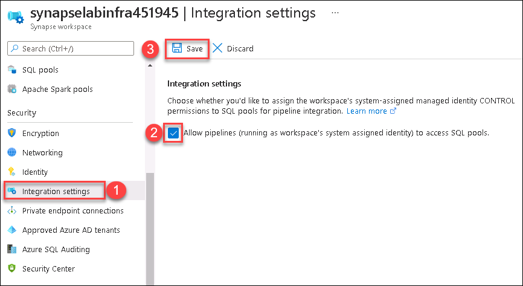

## Exercise 1: Set up SQL pool access and create table

Time required: 10 minutes


A dedicated SQL Pool is one of the analytic runtimes in Azure Synapse Analytics that help you ingest, transform, model, and analyze your data. It offers T-SQL based compute and storage capabilities. With a dedicated SQL pool in your Synapse workspace, data can be loaded, modeled, processed, and delivered for faster analytic insight.

### Task 1: Allow pipelines to access SQL pools

Later in this lab, you will use the Automated Integration Runtime (IR) to copy data to the dedicated SQL pool within a data flow. But first, you must adjust the system assigned managed identity settings for your Synapse workspace to allow pipelines to access the pool.

1. Navigate to the Azure portal (<https://portal.azure.com>).

2. In the search menu, type **Synapse**, then select **Azure Synapse Analytics**.

    

3. Select the Synapse Workspace that you created for this lab, or that was provided for you in the lab environment.

4. Select **Integration Settings** in the left-hand menu, check the box to **Allow pipelines (running as workspace's system assigned identity) to access SQL pools**, then select **Save**.

    

### Task 2: Create table

1. Select **Overview** in the left-hand menu of the Synapse workspace, then select **Open** underneath **Open Synapse Studio** from the Synapse workspace page.

    

    After authenticating your account, you should see the Synapse Studio home page for your workspace.

    

2. If you see the Getting started dialog, select **Close**.

    

3. Select the **Develop** hub.

    

4. Select **+**, then select **SQL script**.

    

5. Enter **Create DelaySummary** in the Name value within the Properties blade. Select the **aiaddw** dedicated SQL pool. Paste the script below into the script area, then select **Run**.

    ```sql
    --Set up Polybase
    CREATE MASTER KEY

    --Create destination table
    CREATE TABLE [dbo].[DelaySummary]
    ( 
        [Year] int NULL,
        [Month] int NULL,
        [DayofMonth] int NULL,
        [DayOfWeek] int NULL,
        [OriginAirportCode] [nvarchar](10)  NULL,
        [DepDelayCount] [bigint] NULL,
        [DepDelay15Count] [bigint] NULL,
        [AIRPORT_ID] [nvarchar](20) NULL,
        [AIRPORT] [nvarchar](100)  NULL,
        [DISPLAY_AIRPORT_NAME] [nvarchar](100) NULL,
        [LATITUDE] [nvarchar](20)  NULL,
        [LONGITUDE] [nvarchar](20)  NULL
    ) WITH
    (
        DISTRIBUTION = ROUND_ROBIN,
        CLUSTERED COLUMNSTORE INDEX
    )
    GO
    ```

    

6. After you run the script, you should see a status that the script executed successfully.

    

7. Select **Publish all**, then select **Publish** in the dialog.

    

    > ※	For the remainder of the lab, select **Publish** as appropriate to save your work.

8. Select the **Data** hub.

    

9. Select the **Workspace** tab, expand **Databases**, expand the **aiaddw** SQL pool, and expand **Tables**. You will see the `DelaySummary` table. If it does not appear, select **Refresh**.

    


Click on **Next** in the below to proceed with the lab.
