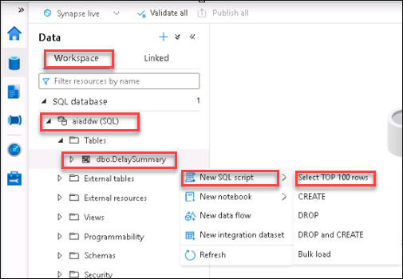

## Exercise 2: Implement Spark ETL with the GUI

Time required: 45 minutes


Mapping data flows are visually designed data transformations in Azure Data Factory. Data flows allow data engineers to develop data transformation logic without writing code. The resulting data flows are executed as activities within Azure Data Factory pipelines that use scaled-out Apache Spark clusters. Data flow activities can be operationalized using existing Azure Data Factory scheduling, control, flow, and monitoring capabilities.

Mapping data flows provide an entirely visual experience with the Synapse Studio GUI, with no coding required. Your data flows run on ADF-managed execution clusters for scaled-out data processing. Azure Data Factory handles all the code translation, path optimization, and execution of your data flow jobs.

### Task 1: Create ADLS Gen2 Linked Service

1. Select the **Manage** hub, **Linked services**, then select **+ New**.

    

2. Select **Azure Data Lake Storage Gen2**, then select **Continue**.

    

3. Enter each setting described below, then select **Test connection**. When the connection is successful, select **Create**.

    

    | Parameters | Settings | Remarks |
    | --- | --- | --- |
    | Name | `key_adls` | |
    | Description | No entry required | Default settings |
    | Connect via integration runtime | AutoResolveIntegrationRuntime | Default settings |
    | Authentication method | Account Key | Default settings |
    | Account selection method | From Azure subscription | Default settings |
    | Azure subscription | Any | Select the Azure subscription for this lab |
    | Storage account name | Any | Select the primary storage account for your Synapse workspace |

### Task 2: Create mapping data flow sources

Create datasets to extract "Flight delay" and "Airport master data".

1. Select the **Develop** hub.

    

2. Select **+**, then select **Data flow**.

    

3. Select the **Data flow debug** switch.

    

4. Select **OK** in the `Turn on data flow debug` dialog.

    

5. Set **FlightDelayETL** for the Name in the Properties blade. Select **Properties** to close the blade, then select **Add Source** on the canvas.

    

6. For **Output stream name**, enter **AirportCodeLocationLookupClean**, and select **+ New** next to **Source dataset**.

    

7. Select **Azure Data Lake Storage Gen2**, then select **Continue**.

    

8. Select the **DelimitedText** format, then select **Continue**.

    

9. Enter each setting as displayed in the table below, and then select **OK**.

    

    | Parameters | Settings | Remarks |
    | --- | --- | --- |
    | Name | `csv_AirportCodeLocationLookupClean` | Be careful not to include extra spaces when copying |
    | Linked service | Select the default storage for your workspace (`<Synapse workspace name>-WorkspaceDefaultStorage`) | |
    | File path | `datalake` | Select file from "From specified path" in the next step |

10. Select the **TravelDatasets** folder, then select **AirportCodeLocationLookupClean.csv** and select **OK**.

    

11. Check **First row as header**, ensure the **From connection / store** import schema option is selected, then select **OK**.

    

12. Select **Add Source** on the canvas below the source you just added.

    

13. For **Output stream name**, enter **FlightDelaysWithAirportCodes**, and select **+ New** next to **Source dataset**.

    

14. Select **Azure Data Lake Storage Gen2**, then select **Continue**.

    

15. Select the **DelimitedText** format, then select **Continue**.

    

16. Enter each setting as displayed in the table below, and then select **OK**.

    

    | Parameters | Settings | Remarks |
    | --- | --- | --- |
    | Name | `csv_FlightDelaysWithAirportCodes` | Be careful not to include extra spaces when copying |
    | Linked service | Select the default storage for your workspace (`<Synapse workspace name>-WorkspaceDefaultStorage`) | |
    | File path | `datalake` | Select file from "From specified path" in the next step |

17. Select the **TravelDatasets** folder, then select **FlightDelaysWithAirportCodes.csv** and select **OK**.

    

18. Check **First row as header**, ensure the **From connection / store** import schema option is selected, then select **OK**.

    

### Task 3: Create a filter

Create a filter for the records.

1. Under the `FlightDelaysWithAirportCodes` source, select **+** in the lower-right corner, and then select **Filter**.

    

2. Under "Filter on", select **Enter filter...**.

    

3. Copy and paste the following query into the Expression box. Select **Refresh** to review the data preview, then select **Save and finish**.

    ```javascript
    toInteger(DepDelay) > 0
    ```

    

### Task 4: Add calculated columns

In this data, a delay of `1:30` is represented as `130`. Create a delay time column with the name "CRSDepHour" so that it can be represented as a `1.3` hour delay.

1. Under the `FlightDelaysWithAirportCodes` source, select **+** in the lower-right corner of the stream (from the new filter you just created), and then select **Derived Column**.

    

2. Under Columns, type **CRSDepHour**, select **Expression**, then select **Open expression builder**.

    

3. Copy and paste the following query into the Expression box. Select **Refresh** to review the Data preview, and then select **Save and finish**.

    ```javascript
    floor(toInteger(CRSDepTime)/100)
    ```

    

### Task 5: Select columns

Add an action to eliminate unnecessary columns so that only the required columns remain.

1. Under the `FlightDelaysWithAirportCodes` source, select **+** in the lower-right corner of the stream (from the new derived column action you just created), and then select **Select**.

    

2. Check **DerivedColumn1's column** to check all columns. Then remove checks from the following nine items: Make sure that **all other items** besides the following nine are checked, and then select **Delete**.

    - Year
    - Month
    - DayofMonth
    - DayOfWeek
    - CRSDepTime
    - DepDelay
    - DepDel15
    - OriginAirportCode
    - CRSDepHour


### Task 6: Aggregation process

Add aggregation processing so that delays are aggregated at the granularity of the year, month, day, and airport.

1. Under the `FlightDelaysWithAirportCodes` source, select **+** in the lower-right corner of the stream (from the new select action you just created), and then select **Aggregate**.

    

2. Select the drop-down arrow on the right of Columns to add the following five columns. Click **+** to add an item:

    - Year
    - Month
    - DayofMonth
    - DayOfWeek
    - OriginAirportCode

    

3. Verify that all five columns have been added, then select **Aggregates**.

    

4. In Columns, type **DepDelayCount**, select **Expression**, then paste `sum(1)`.

    

5. Select **+** to the right of the column you just added, then select **Add column**.

    

6. In Columns, type **DepDelay15Count**, select **Expression**, then paste `sum(toInteger(DepDel15))`.

    

### Task 7: Data join process

Combine data sources.

1. Under the `FlightDelaysWithAirportCodes` source, select **+** in the lower-right corner of the stream (from the new aggregate action you just created), and then select **Join**.

    

2. Within the Join settings form, enter each setting as described in the table below.

    

    | Parameters | Settings | Remarks |
    | --- | --- | --- |
    | Output stream name | `Join1` | Default settings |
    | Left stream | `Aggregate1` | |
    | Right stream | `AirportCodeLocationLookupClean` | This is the first data source you added |
    | Join type | `Inner` | Default settings |
    | Left: Aggregate1's column | `OriginAirportCode` | |
    | Right: AirportCodeLocationLookupClean's column | `AIRPORT` | |

### Task 8: Data output

Add a sink process to output to the SQL Pool and create a dataset that defines the destination table information.

1. Under the `FlightDelaysWithAirportCodes` source, select **+** in the lower-right corner of the stream (from the new join action you just created), and then select **Sink**.

    

2. Select **+ New** next to the Sink dataset.

    

3. Select **Azure Synapse Analytics**, then select **Continue**.

    

4. Enter each setting as displayed in the table below, and then select **OK**.

    

    | Parameters | Settings | Remarks |
    | --- | --- | --- |
    | Name | `dw_DelaySummary` | Be careful not to include extra spaces when copying |
    | Linked service | Select the default SQL server for your workspace (`<Synapse workspace name>-WorkspaceDefaultSqlServer`) | |
    | Table name | None | Default settings, set in subsequent steps |
    | Import schema | None | Default settings |

5. Select **Open** next to the Sink dataset.

    

6. Under the **Connection** tab of the dataset properties, enter **aiaddw** SQL pool name for the **DBName** value. Select **Refresh** next to the table list, then select **dbo.DelaySummary** from the list.

    

7. Select the **FlightDelayETL** tab to switch back to the mapping data flow. Select **Sink1**, select the **Settings** tab, then select **Truncate table** in the Table action options list. Make sure **Enable staging** is also checked.

    

8. Select **Publish all**, then select **Publish** in the dialog.

    

### Task 9: Create and run Pipeline

1. Select the **Integrate** hub, select **+**, then select **Pipeline**.

    

2. For **Name**, enter `FlightDelay`, then select **Properties** to close the dialog.

    

3. Expand **Move & transform** under the Activities menu. Drag and drop the **Data flow** activity onto the canvas area to the right.

    

4. In the Adding data flow dialog, select **Use existing data flow**, select **FlightDelayETL** from the existing data flow list, then select **Finish**.

    

5. Select the **Settings** tab, select **key_adls** from the **Staging linked service** list, then enter **datalake** in the container field and **polybase** in the folder field of the **Staging storage folder** setting.

    

6. Select **Publish all**, then select **Publish** in the dialog.

    

7. Select **Add trigger**, then select **Trigger now**.

    

8. Select **OK** to run the trigger.

    

9. Select the **Monitor** hub, then **Pipeline runs**. If the pipeline run status is `Succeeded` after a few minutes, then the pipeline run successfully completed.

    

> **Note**: Mapping Data Flow runs with a minimum overhead of at least five to six minutes. This is because you are creating a Spark processing environment each time you run it. If you are using an ETL pipeline using Mapping Data Flow, plan your batch schedule with time in mind for creating a processing environment.

> **Note**: Some of the imported data has a prepared dataset that has been amplified to 100 million items under the name "FlightDelaysWithAirportCodes100M.csv". With this csv data, you can see the scalability of Mapping Data Flow for 100 million data processes.

### Task 10: View the transformed data

When the data flow pipeline has successfully completed, view the data it wrote to the `dbo.DelaySummary` SQL pool table.

1. Select the **Data** hub.

    

2. Select the **Workspace** tab, expand **SQL database**, expand the **aiaddw** SQL pool, and expand **Tables**. Right-click on the `DelaySummary` table, select  **New SQL script**, then select **Select TOP 100 rows**.

    

3. View the results of the executed script. Notice that the derived columns, joined columns, and aggregates you added to the Mapping Data Flow appear in the result set.

    
