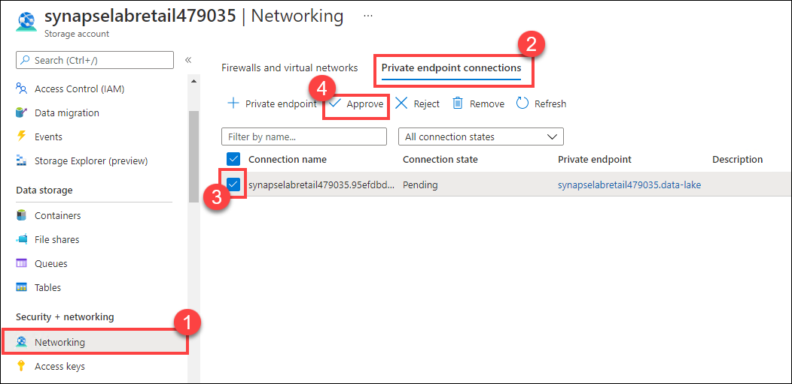

## Exercise 1: Security

Time required: 10 minutes

### Task 1: Enable private endpoint on the data lake

Managed private endpoint uses a private IP address from within the Synapse workspace's Managed Virtual Network to connect to an Azure resource or your own private link service. Connections using managed private endpoints provide access to Azure resources or private link services.

When you created the Synapse workspace during the lab setup, you enabled the managed virtual network (VNet) option. If you are using a hosted lab environment, the Synapse workspace was provisioned with a VNet for you. This setting allows the workspace to be network-isolated and to be linked from the VNet privately to the SQL pool, Spark pool, and other Azure services, such as ADLS Gen2 and Azure Cosmos DB.

The use of private links protects traffic from the risk of data breaches because it passes through Microsoft's backbone network.


When you create datasets with the ADLS Gen2 account's Synapse linked service later in this lab, you will not be able to connect to the service unless you configure a managed endpoint.

In this task, you create a new managed private endpoint for the ADLS Gen2 account.

1. Navigate to the Azure portal (<https://portal.azure.com>).

2. In the search menu, type **Synapse**, then select **Azure Synapse Analytics**.

    

3. Select the **Overview** blade in the left-hand menu, then select **Open** underneath **Open Synapse Studio** to navigate to Synapse Studio for this workspace.

    

4. If you see the Getting started dialog, select **Close**.

    

5. In Synapse Studio, select the **Manage hub**.

    

6. Select **Managed private endpoints** on the left-hand menu, then select **+ New**.

    

7. Select **Azure Data Lake Storage Gen2**, then select **Continue**.

    

8. On the new managed private endpoint form, enter **`data-lake`** for the name. Select the ADLS Gen2 primary account for the Synapse workspace (ex. `synapselabretail` + unique id), then select **Create**.

    

9. While you are in the Manage hub, select **SQL pools** on the left-hand menu. If the dedicated SQL pool (`SqlPool`) is paused, hover over it and select **Resume**.

    

10. Return to the `synapse-lab-retail` resource group used for this lab, and select the ADLS Gen2 primary account for the Synapse workspace (ex. `synapselabretail` + unique id) within.

    

11. Select **Networking** on the left-hand menu **(1)**, then select the **Private endpoint connections** tab **(2)**. You should see the new private endpoint connection in a Pending status. Before you can use it, you must approve the request. **Check** the pending request **(3)**, then select **Approve (4)**.

    

12. Enter a description for the approval, such as "Synapse data lake", then select **Yes** to complete the approval.

    

13. Return to Synapse studio and select the **Manage hub**.

    

14. Select **Managed private endpoints** on the left-hand menu. You should see the new **data-lake** private endpoint. It will take about 1-2 minutes for the approval status to refresh. Select the **Refresh** button periodically until the approval status shows as Approved.

    

### Task 4: Add the workspace managed identity to database role

Later on in this lab, you will create a data pipeline that includes a copy activity which copies data into the dedicated SQL pool. This will fail unless you add the managed identity account to the `db_owner` database role.

1. Navigate to the **Data hub**.

    

2. Select the **Workspace** tab **(1)**, expand SQL Database and right-click on **SqlPool (2)**. Select **New SQL script (3)**, then **Empty script (4)**.

    

3. Paste the following script and **Run** it to create a new user for your workspace's managed identity, and to add it to the `db_owner` role. **Replace** `YOUR_SYNAPSE_WORKSPACE_NAME` with the name of your Synapse Analytics workspace. You can find this value at the top of Synapse Studio, as shown in the screenshot below.

    ```sql
    CREATE USER [YOUR_SYNAPSE_WORKSPACE_NAME] FROM EXTERNAL PROVIDER;
    EXEC sp_addrolemember N'db_owner', N'YOUR_SYNAPSE_WORKSPACE_NAME'
    ```

    The screenshot below shows where to find the Synapse workspace name.

    

    **Note**: If you receive an error after running the script, `User, group, or role 'synapselabretail#####' already exists in the current database.`, you can ignore the error and continue. This may happen if you are running the lab in a hosted environment.

    

### Task 5: Managed identity

When accessing other services in the Azure Synapse workspace, authentication is now possible using a system allocated ID. This allows authentication in conjunction with Azure AD without using the credentials issued within each service (such as a Data Lake Storage access key).

1. Return to the `synapse-lab-retail` resource group and select the Azure Synapse Analytics workspace within.

    

2. On the **Overview** blade, observe the **Managed Identity object ID** value.

    

3. Return to Synapse Studio, then select the **Manage hub**.

    

4. Select **Linked services** in the left-hand menu, then select **+ New**.

    

5. Select **Azure Data Lake Storage Gen2**, then **Continue**.

    

6. On the new linked service form, select **Managed Identity** for the authentication method, select the ADLS Gen2 primary account for the Synapse workspace (ex. `synapselabretail` + unique id). You will see the `data-lake` **Managed private endpoint** selected with the **Approved** status, and the Managed identity name and object ID values displayed below **(3)**.

    

7. Select **Create** to finish creating the new linked service.

8. Select **Publish all**, then **Publish** to save all the changes.
