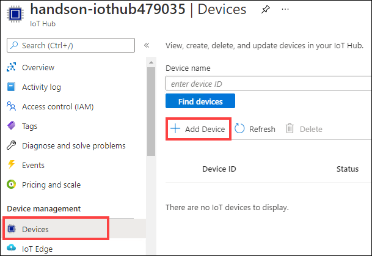
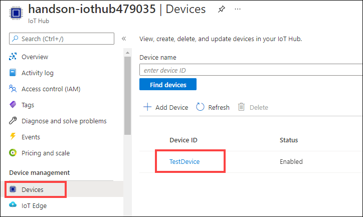
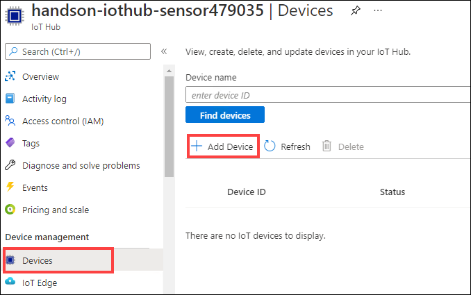
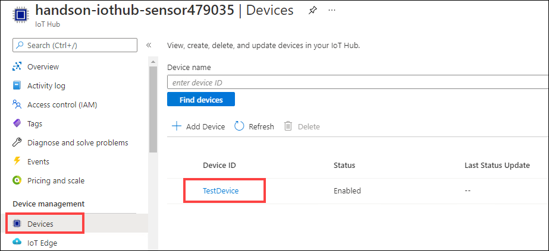
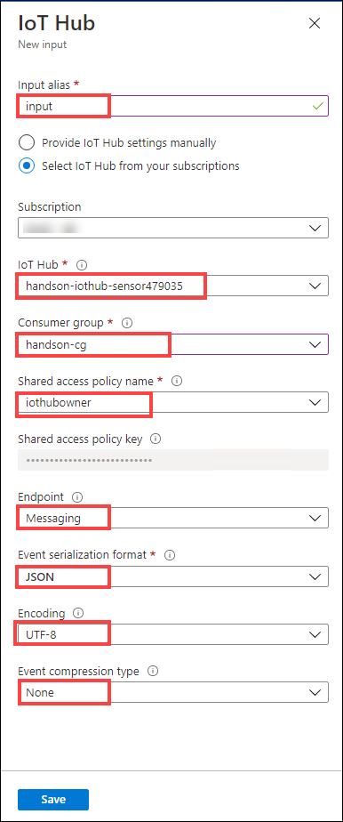
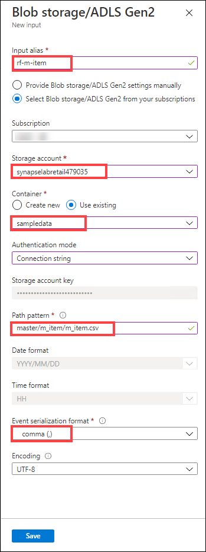
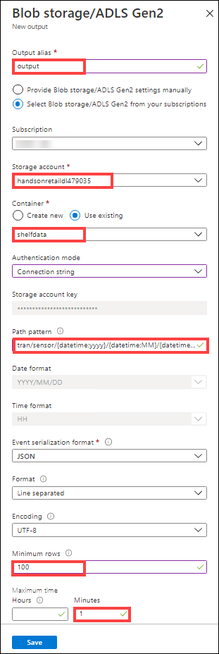
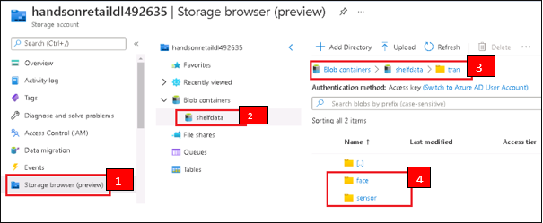

## Exercise 2: Data collection

Time required: 20 minutes

In data collection, you will collect and process stream data flowing from IoT devices in real time and store it in the data lake.

You will learn:

- **Data Lake Storage construction**: Build a data lake to store collected data.

- **IoT Hub construction**: Build a gateway to connect devices in Azure end-to-end and enable secure two-way communication.

- **Stream Analytics construction**: Build workload to analyze and process streaming data flowing through IoT Hub in real time.

- **Send streaming data from IoT devices**: Using IoT Hub client, implement processing to send messages from a device to IoT Hub.


### Task 1: Register an IoT device (for AI camera)

1. Navigate to the `synapse-lab-retail` resource group. In the Azure portal, use the top search bar to search for `synapse-lab-retail`, then select the **synapse-lab-retail** resource group in the search results under **Resource Groups**.

    

2. Within the resource group, select the **`handson-iothub + <unique suffix>`** IoT Hub account.

    

3. Select **Devices** on the left-hand menu, then select **+ Add Device**.

    

4. In the **Create a device** form, complete the following:

   | Field                          | Value                                              |
   | ------------------------------ | ------------------------------------------         |
   | Device ID                   | _enter `TestDevice`_              |
   | Authentication type                 | _select `Symmetric key`_                      |
   | Auto-generate keys           | _check the box_      |
   | Connect this device to an IoT hub | _select `Enable`_             |

   

5. Select **Save**.

### Task 2: Save IoT device connection information (for AI camera)

1. Select the **TestDevice** that you just added.

    

2. Copy the **Primary Connection String** and save it to a text editor, such as Notepad. This connection string is used to send stream data from IoT devices in subsequent work.

    

### Task 3: Register another IoT device (for weight sensor)

1. Navigate to the `synapse-lab-retail` resource group. In the Azure portal, use the top search bar to search for `synapse-lab-retail`, then select the **synapse-lab-retail** resource group in the search results under **Resource Groups**.

    

2. Within the resource group, select the **`handson-iothub-sensor + <unique suffix>`** IoT Hub account (notice there are two IoT Hub accounts - this one contains the word **sensor**).

    

3. Select **Devices** on the left-hand menu, then select **+ Add Device**.

    

4. In the **Create a device** form, complete the following:

   | Field                          | Value                                              |
   | ------------------------------ | ------------------------------------------         |
   | Device ID                   | _enter `TestDevice`_              |
   | Authentication type                 | _select `Symmetric key`_                      |
   | Auto-generate keys           | _check the box_      |
   | Connect this device to an IoT hub | _select `Enable`_             |

   

5. Select **Save**.

### Task 4: Save IoT device connection information (for weight sensor)

1. Select the **TestDevice** that you just added.

    

2. Copy the **Primary Connection String** and save it to a text editor, such as Notepad. This connection string is used to send stream data from IoT devices in subsequent work.

    

> **What is device registration?**
>
> Issue device IDs and connection keys by registering devices in IoT Hub. Using the issued IDs and keys enables secure communication between devices and the IoT Hub.

### Task 5: Stream Analytics (for AI cameras) input settings

1. Navigate to the `synapse-lab-retail` resource group. In the Azure portal, use the top search bar to search for `synapse-lab-retail`, then select the **synapse-lab-retail** resource group in the search results under **Resource Groups**.

    

2. Within the resource group, select the **`handson-SAJ + <unique suffix>`** Stream Analytics job.

    

3. Select **Inputs** on the left-hand menu, select **+ Add stream input**, then select **IoT Hub** from the list.

    

4. In the **IoT Hub** form, complete the following:

   | Field                          | Value                                              |
   | ------------------------------ | ------------------------------------------         |
   | Input alias                   | _enter `input`_              |
   | IoT Hub                 | _select `handson-iothub + <unique suffix>`_                      |
   | Endpoint           | _select `Messaging`_      |
   | Shared access policy name | _select `iothubowner`_             |
   | Consumer group | _select `handson-cg` (this was created for you by the ARM template)_ |
   | Event serialization format | _select `JSON`_ |
   | Encoding | _select `UTF-8`_ |
   | Event compression type | _select `None`_ |

   

5. Select **Save**.

### Task 6: Stream Analytics (for AI cameras) output settings

1. Select **Outputs** on the left-hand menu, select **+ Add**, then select **Blob storage/ADLS Gen2** from the list.

    

2. In the **Blob storage/ADLS Gen2** form, complete the following:

   | Field                          | Value                                              |
   | ------------------------------ | ------------------------------------------         |
   | Input alias                   | _enter `output`_              |
   | Storage account                 | _select `handsonretaildl + <unique suffix>`_                      |
   | Container           | _select `Use existing`, then select `shelfdata`_      |
   | Path pattern | _enter `tran/face/{datetime:yyyy}/{datetime:MM}/{datetime:dd}`_             |
   | Event serialization format | _select `JSON`_ |
   | Encoding | _select `UTF-8`_ |
   | Format | _select `Line separated`_ |
   | Minimum rows | _enter `100`_ |
   | Maximum time | _enter `1 minute`_ |
   | Authentication mode | _select `Connection string`_ |

   

   > **Minimum rows and maximum time**
   >
   > Must be specified when Parquet is selected in Event serialization format.
   >
   > **Minimum rows**: Minimum number of rows per batch. A new file is created for each batch.
   >
   > **Maximum time**: After a set amount of time and even if the minimum row count requirements are not met, the batch is written to the output.

3. Select **Save**.

### Task 7: Stream Analytics (for AI cameras) query settings

1. Select **Query** on the left-hand menu.

2. Enter the following query, then select **Save query**:

    ```sql
    SELECT
    face_id, date_time, age, gender
    INTO
    [output]
    FROM
    [input] TIMESTAMP BY date_time
    ```

    

3. Select **Overview** on the left-hand menu, then select **Start**.

    

4. Select **Now** for the job output start time, then select **Start**.

    

### Task 8: Stream Analytics (for weight sensors) input settings

1. Navigate to the `synapse-lab-retail` resource group. In the Azure portal, use the top search bar to search for `synapse-lab-retail`, then select the **synapse-lab-retail** resource group in the search results under **Resource Groups**.

    

2. Within the resource group, select the **`handson-SAJ-sensor + <unique suffix>`** Stream Analytics job.

    

3. Select **Inputs** on the left-hand menu, select **+ Add stream input**, then select **IoT Hub** from the list.

    

4. In the **IoT Hub** form, complete the following:

   | Field                          | Value                                              |
   | ------------------------------ | ------------------------------------------         |
   | Input alias                   | _enter `input`_              |
   | IoT Hub                 | _select `handson-iothub-sensor + <unique suffix>`_                      |
   | Endpoint           | _select `Messaging`_      |
   | Shared access policy name | _select `iothubowner`_             |
   | Consumer group | _select `handson-cg` (this was created for you by the ARM template)_ |
   | Event serialization format | _select `JSON`_ |
   | Encoding | _select `UTF-8`_ |
   | Event compression type | _select `None`_ |

   

5. Select **Save**.

6. Select **+ Add reference input**.

    

7. In the **IoT Hub** form, complete the following:

   | Field                          | Value                                              |
   | ------------------------------ | ------------------------------------------         |
   | Input alias                   | _enter `rf-m-item`_              |
   | Storage account                 | _select `synapselabretail` + unique id (example: `synapselabretail311170`) This is the ADLS Gen2 account created along with the Synapse Analytics workspace_                      |
   | Container           | _select `Use existing`, then select **`sampledata`**_      |
   | Path pattern | _enter `master/m_item/m_item.csv`_             |
   | Event serialization format | _select `CSV`_ |
   | Delimiter | _select `comma (,)`_ |
   | Encoding | _select `UTF-8`_ |

   

8. Select **Save**.

### Task 9: Stream Analytics (for weight sensors) output settings

1. Select **Outputs** on the left-hand menu, select **+ Add**, then select **Blob storage/ADLS Gen2** from the list.

    

2. In the **Blob storage/ADLS Gen2** form, complete the following:

   | Field                          | Value                                              |
   | ------------------------------ | ------------------------------------------         |
   | Input alias                   | _enter `output`_              |
   | Storage account                 | _select `handsonretaildl + <unique suffix>`_                      |
   | Container           | _select `Use existing`, then select `shelfdata`_      |
   | Path pattern | _enter `tran/sensor/{datetime:yyyy}/{datetime:MM}/{datetime:dd}`_             |
   | Event serialization format | _select `JSON`_ |
   | Encoding | _select `UTF-8`_ |
   | Format | _select `Line separated`_ |
   | Minimum rows | _enter `100`_ |
   | Maximum time | _enter `1 minute`_ |
   | Authentication mode | _select `Connection string`_ |

   

3. Select **Save**.

### Task 10: Stream Analytics (for weight sensors) query settings

1. Select **Query** on the left-hand menu.

2. Enter the following query, then select **Save query**:

    ```sql
    SELECT
      [input].face_id
    , [input].shelf_id
    , [input].sensor_no
    , [input].date_time
    , [input].sensor_weight
    , [input].diff_weight
    , [rf-m-item].item_genre
    , [rf-m-item].item_name
    , [rf-m-item].item_price
    INTO
        [output]
    FROM
        [input] TIMESTAMP BY date_time
    JOIN
        [rf-m-item]
        ON [input].shelf_id = [rf-m-item].shelf_id
        AND [input].sensor_no = [rf-m-item].sensor_no
    ```

    

3. Select **Overview** on the left-hand menu, then select **Start**.

    

4. Select **Now** for the job output start time, then select **Start**.

    

#### Additional information: Using reference data in Stream Analytics

Browse data stored in a SQL Database or Blob storage (including Azure Data Lake Storage Gen2) with Stream Analytics.

Imagine a use case where static or infrequently modified data is stored as reference data, which is combined with associated stream data from IoT devices.

The concept of this use is expressed in this hands-on training, as follows.

> ※ Direct output of Stream Analytics jobs at up to 200 MB/s to Azure Synapse dedicated SQL pools is now possible due to new Synapse features. In this scenario, you will output to the data lake.


**Stream data (weight sensor)**

| face_id | shelf_id | sensor_no | date_time | sensor_weight | diff_weight |
| --- | --- | --- | --- | --- | --- |
| XXX | **01** | **02** | XXX | XXX | XXX |

**Product master**

| shelf_id | sensor_no | item_genre | item_name | item_price |
| --- | --- | --- | --- | --- |
| **01** | **02** | Produce | Apple | 100 |

**Post-processing data** ※ *Combines stream data and product master with shelf_id and sensor_no as the keys*

| face_id | shelf_id | sensor_no | date_time | sensor_weight | diff_weight | item_genre | item_name | item_price |
| --- | --- | --- | --- | --- | --- | --- | --- | --- |
| XXX | **01** | **02** | XXX |	XXX | XXX | Produce | Apple | 100 |

### Task 11: Prepare to send data

1. Log in to your lab VM.

2. Open Windows Explorer and navigate to **`C:\handson\program\`**.

3. Open **SendFaceData.js** in Notepad and replace the `connectionString` value between the single quotes (`'REPLACE-WITH-YOUR-CONNECTION-STRING'`) on **line 7** with the IoT device connection string that you copied in Task 2 (for AI camera).

    

4. **Save** the file.

5. Open **SendSensorData.js** in Notepad and replace the `connectionString` value between the single quotes (`'REPLACE-WITH-YOUR-CONNECTION-STRING'`) on **line 7** with the IoT device connection string that you copied in Task 4 (for weight sensor).

    

6. **Save** the file.

> **Connecting from an IoT device**
>
> Install IoT Hub Client (SDK) on the IoT device. Specify the connection string issued to the device when the device ID is registered via IoT Hub.
>
> 

### Task 12: Send data

1. On your lab VM, open the **Command Prompt**. You can do this by clicking Start and entering `cmd` to find and select the Command Prompt app.

    

2. In the Command Prompt, execute `cd C:\handson\program` to change directories.

3. Install the required `azure-iot-device-mqtt` and `azure-iot-device` Node.js modules by executing the following command:

    ```cmd
    npm install
    ```

4. Send AI camera data by running the following command at the command prompt:

    ```cmd
    node SendFaceData.js
    ```

    In a few moments, the simulated IoT device will start sending telemetry to IoT Hub:

    

5. Allow the simulator to continue to run in the background. Open a **new Command Prompt** window.

6. In the new Command Prompt, execute `cd C:\handson\program` to change directories.

7. Send weight sensor data by running the following command at the command prompt:

    ```cmd
    node SendSensorData.js
    ```

    Just as happened in the other command prompt, the simulated IoT device will start sending telemetry to IoT Hub:

    

8. Allow the simulator to continue to run in the background while you continue the following steps.

### Task 13: Verify sent data

To verify that the IoT Hub devices are successfully retrieving the data, and that the Stream Analytics jobs are retrieving, processing, and writing the data to storage, perform the following steps:

1. Navigate to the `synapse-lab-retail` resource group. In the Azure portal, use the top search bar to search for `synapse-lab-retail`, then select the **synapse-lab-retail** resource group in the search results under **Resource Groups**.

    

2. Within the resource group, select the ADLS Gen2 account you created in Task 2, named **`handsonretaildl` + `<unique suffix>`**.

    

3. Select **Storage browser (preview)** in the left-hand menu **(1)**, expand Blob containers and select **shelfdata (2)**, then open the **tran** folder **(3)**. Verify that you see the **`face`** and **`sensor`** folders **(4)**. These are created by the two Stream Analytics jobs. If you don't see both folders, try refreshing the list after about a minute.

    

4. Confirm that a JSON file has been created in the following folders in the data lake:

    - AI camera data: `shelfdata/tran/face/YYYY/MM//DD/`
    - Weight sensor data: `shelfdata/tran/sensor/YYYY/MM//DD/`

    

    > ※ YYYY/MM/DD contains the current date.
