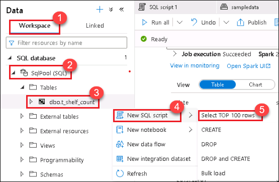
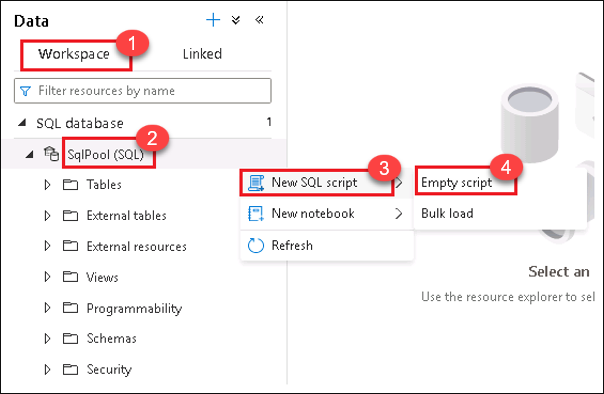
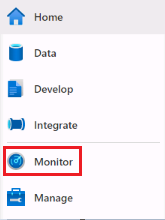
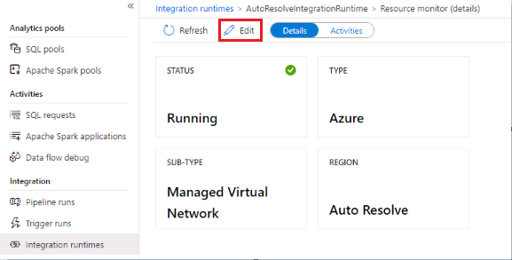
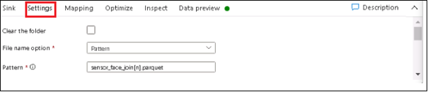
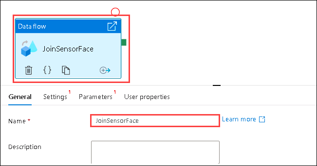
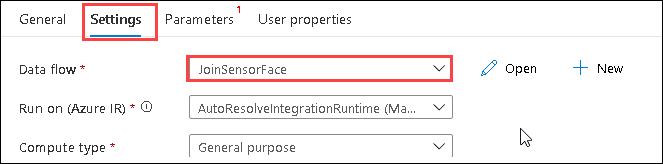

## Exercise 3: Data aggregation

Time required: 40 minutes

In the data aggregation, after data collected in the data lake in various formats is processed with an ETL designed in the GUI, you will ingest it at high speed with distributed processing using Apache Spark and process it to the point where you create a data mart.

In this exercise, you will learn:

- **Apache Spark implementation**: Create a Synapse notebook within Synapse Studio, and implement data aggregation processing using Apache Spark.

- **Data flow construction**: Visually build an ETL pipeline in a code-free way in Synapse Studio to make subsequent processing of various data format files stored in the data lake easier.

- **Pipeline construction**: Build a data pipeline to periodically run a flow from data extraction, conversion, and loading to aggregation.

The diagram below shows the Synapse Studio elements that help us build the data pipeline:


### Task 1: Create notebook

1. Return to the `synapse-lab-retail` resource group and select the Azure Synapse Analytics workspace within.

    

2. Select the **Overview** blade in the left-hand menu, then select **Open** underneath **Open Synapse Studio** to navigate to Synapse Studio for this workspace.

    

3. In Synapse Studio, navigate to the **Data hub** in the left-hand menu.

    

4. Select the **Linked** tab **(1)**, expand `Azure Data Lake Storage Gen2`, expand the primary storage account, then select the **sampledata** container **(2)**. Navigate to **`tran\sensor\2020\04\01` (3)**, right-click on the JSON file **(4)**, select **New notebook (5)**, then select **Load to DataFrame (6)**.

    

5. In the new notebook, notice that Cell 1 is automatically populated with Python code that loads the JSON file into a new DataFrame, then displays the first 10 rows. Select **Run all** to execute the notebook.

    

    > Please note that it takes several minutes to execute the notebook for the first time. This is because the Spark pool needs to start and allocate resources.

    You should see an output similar to the following:

    

6. Hover below the cell and select **{} Add code** to add a new cell.

    

7. Execute the following code to load the DataFrame into a temporary table:

    ```python
    df = df.select("face_id","shelf_id","sensor_no","item_genre","item_name","date_time","sensor_weight","diff_weight")
    df.registerTempTable( "be_df_table" )
    ```

    > You can execute **Ctrl+Enter** to run the cell, or **Shift+Enter** to run the cell and create a new one below.

8. Execute the following in a new cell to aggregate data stored in the temporary view:

    ```python
    df = spark.sql("""
        SELECT
        SUBSTRING(date_time, 1, 10) as date
        ,shelf_id
        ,count(*) as count
        FROM be_df_table
        GROUP BY SUBSTRING(date_time, 1, 10), shelf_id
        ORDER BY SUBSTRING(date_time, 1, 10), shelf_id
        """
                )            
    df.registerTempTable( "af_df_table" )
    ```

9. Execute the following in a new cell to set the cell language to SQL and view the aggregation results:

    ```python
    %%sql
    SELECT * FROM af_df_table limit 5
    ```

    Your output should look similar to the following:

    

10. Execute the following in a new cell to write the aggregated data to the dedicated SQL pool, using the Spark SQL Analytics connector:

    ```scala
    %%spark
    val s_df = spark.sql("SELECT * FROM af_df_table")
    s_df.write.
        sqlanalytics("SqlPool.dbo.t_shelf_count", Constants.INTERNAL)
    ```

    > Spark SQL Analytics connector is only available in Scala, so we switch to Scala with `%%spark`.

11. After the cell finishes executing, navigate to the **Data hub**.

    

12. Select the **Workspace** tab **(1)**, expand **SqlPool** under SQL Database **(2)**, then expand the Tables list. If you do not see the `t_shelf_count` table, refresh the list. **Right-click** on the **`t_shelf_count`** table **(3)**, select **New SQL script (4)**, then **Select TOP 100 rows (5)**.

    

    You should see an output that looks similar to the following:

    

#### Apache Spark overview

Apache Spark is a distributed processing framework for high-speed processing of large-scale data. In contrast, with a similar distributed processing framework, Hadoop, which must frequently access the disk for IO, Spark is in-memory processing that saves data to the memory, so the IO overhead is smaller, and the overall execution speed is improved.

Spark on Synapse can be developed in Scala, Python, .NET, and SQL.


##### About Spark SQL Analytics connectors

Typically, when using JDBC, the data is transferred serially.
The risk of bottlenecks exists, but the import/export between the serverless Spark pool and dedicated SQL pool using PolyBase enables data to be transferred efficiently.

In addition, because authentication between systems uses a security token provided by Azure AD, it is not necessary to specify the authentication information in the program code.

##### Check job execution status

When you execute processing on the Synapse notebook, you can check the execution status and execution results on cell-by-cell basis.

Expand the job execution pane under the cell after execution completes to view the list of job executions:


You can check more details by selecting **View in monitoring**, and you can also check the Spark execution log.

> Select Synapse Studio > Monitor > Activities > Apache Spark applications to open the same screen.


### Task 2: Implement processing

By aggregating personal attributes of visitors acquired by AI cameras installed in a certain supermarket, you would like to investigate the number of visitors by gender and age.

Create a notebook (`face_count`) and implement the aggregation process for the reference below. When finished, run all cells to ensure that they are successful.

> The table created (`t_face_count`) will be used in data visualization in a later exercise.

#### File path to be aggregated (JSON format)

`abfss://sampledata@synapsehandson.dfs.core.windows.net/tran/face/2020/04/01/`

Sample data (data items: `face_id`, `date_time`, `age`, and `gender`):

```json
{"face_id":"051a09cb-822b-4baf-9cf6-dbdbc66c01e3","date_time":"2020-04-01T14:34:10.0000000","age":"70","gender":"female"}
{"face_id":"109f5625-0b2c-48a1-abb0-35f2c6d36ed6","date_time":"2020-04-01T14:34:05.0000000","age":"60","gender":"female"}
{"face_id":"1e21ac27-81fc-4456-bb09-cf9fa41f9e43","date_time":"2020-04-01T14:33:39.0000000","age":"40","gender":"female"}
```

#### Summary conditions: Number of visitors by gender and age group (per day)

- Use the GROUP BY function to aggregate with `date_time`, `gender`, and `age`.

    > In order to aggregate per day, date_time is converted to a format using the following SUBSTRING function: `⇒ SUBSTRING (date_time, 1, 10)`

- Use the COUNT function to count the number of records aggregated by `date`, `gender`, and `age`.
- Use the ORDER BY function to sort `date`, `gender`, and `age` in ascending order.

#### Table name of the aggregate data output destination: `t_face_count`

Sample data (data items: `date`, `gender`, `age`, and `count`):

| date | gender | age | count |
| --- | --- | --- | --- |
| 2020/04/01 | female | 10 | 7 |
| 2020/04/01 | female | 20 | 8 |
| 2020/04/01 | female | 30 | 14 |

1. Navigate to the **Develop hub**.

    

2. Select **+**, then select **Notebook**.

    

3. Set the notebook name to **item_count** under the Properties.

    

4. Select **{} Add code** to add a new cell to the notebook.

5. Paste the following into the cell. Replace **`YOUR_DATA_LAKE_NAME`** with the name of the primary ADLS Gen2 account for your Synapse workspace (ex. `synapselabretail` + unique id):

    ```python
    file_path = 'abfss://sampledata@YOUR_DATA_LAKE_NAME.dfs.core.windows.net/out/join/'
    ```

    > Running the notebook at this point will result in an error. Please Publish without running, after adding the remaining cells.

6. Add the following to a new cell to load the file to a new Spark DataFrame and store the data in a new Spark temporary view:

    ```python
    df = spark.read.load(file_path, format='parquet')
    df = df.select("face_id","shelf_id","sensor_no","item_genre","item_name","date_time","sensor_weight","diff_weight","age","gender")
    df.registerTempTable( "be_df_table" )
    ```

7. Add the following to a new cell to aggregate the data stored in the temporary view:

    ```python
    grp_df = spark.sql("""
        SELECT
        SUBSTRING(date_time, 1, 10) AS date
        ,gender
        ,age
        ,item_genre
        ,item_name
        ,count(*) as item_count
        FROM be_df_table
        GROUP BY SUBSTRING(date_time, 1, 10), gender, age, item_genre, item_name
        ORDER BY SUBSTRING(date_time, 1, 10), gender, age, item_genre, item_name
        """
                )
    ```

8. Add the following to a new cell to output to the data lake in Parquet format. Replace **`YOUR_DATA_LAKE_NAME`** with the name of the primary ADLS Gen2 account for your Synapse workspace, which is the same value you added to Cell 1:

    ```python
    output_path = "abfss://sampledata@YOUR_DATA_LAKE_NAME.dfs.core.windows.net/out/item_count/"
    grp_df.write.mode("overwrite").parquet(output_path)
    ```

    Your completed notebook should look similar to the following:

    

9. Select **Publish all**, then **Publish** to save your notebook.

    

### Task 3: Create a table for the pipeline

1. Navigate to the **Data hub**.

    

2. Select the **Workspace** tab **(1)**, expand SQL Database and right-click on **SqlPool (2)**. Select **New SQL script (3)**, then **Empty script (4)**.

    

3. Paste the following script and **Run** it to create a new `t_item_count` table:

    ```sql
    CREATE TABLE [dbo].[t_item_count]
    (
        [date] [nvarchar](4000)  NULL,
        [gender] [nvarchar](4000)  NULL,
        [age] [nvarchar](4000)  NULL,
        [item_genre] [nvarchar](4000)  NULL,
        [item_name] [nvarchar](4000)  NULL,
        [item_count] [bigint]  NULL
    )
    ```

### Task 4: Enable interactive authoring on the integration runtime

The interactive authoring capability is used during authoring for functionalities like testing the connection, browsing and previewing data, and importing a schema inside a managed Virtual Network.

1. Navigate to the **Monitor hub**.

    

2. Select **Integration runtimes** in the left-hand menu, then select the **AutoResolveIntegrationRuntime**.

    

3. Select **Edit** below the `Resource Montior(details)`page.

    

4. Select **Enable** next to `Interactive authoring`, then **Apply**.

    

    > It takes about 1 to 2 minutes to turn on interactive authoring.

### Task 5: Create a dataset for weight sensor data

1. Navigate to the **Data hub**.

    

2. Select **+**, then **Integration dataset**.

    

3. Select **Azure Data Lake Storage Gen2**, then select **Continue**.

    

4. Select **Json** on the format selection screen, then select **Continue**.

    

5. In the dataset properties form, complete the following:

   | Field                          | Value                                              |
   | ------------------------------ | ------------------------------------------         |
   | Name | _enter `input_sensor`_ |
   | Linked service | _select `AzureDataLakeStorage1` (This is the linked service that you created at the beginning of the lab)_ |
   | File path | _enter `sampledata` for the file system, then enter `tran/sensor/2020/04/01` for the directory_ |
   | Import schema | _select `From connection/store`_ |

   

6. Select **OK**.

7. After the dataset creation completes, open it and select **Test connection** to verify that the connection is successful. You may also choose to preview the data here.

    

### Task 6: Create a dataset for AI camera data

1. Navigate to the **Data hub**.

    

2. Select **+**, then **Integration dataset**.

    

3. Select **Azure Data Lake Storage Gen2**, then select **Continue**.

    

4. Select **Json** on the format selection screen, then select **Continue**.

    

5. In the dataset properties form, complete the following:

   | Field                          | Value                                              |
   | ------------------------------ | ------------------------------------------         |
   | Name | _enter `input_face`_ |
   | Linked service | _select `AzureDataLakeStorage1` (This is the linked service that you created at the beginning of the lab)_ |
   | File path | _enter `sampledata` for the file system, then enter `tran/face/2020/04/01` for the directory_ |
   | Import schema | _select `From connection/store`_ |

   

6. Select **OK**.

### Task 7: Create a dataset for intermediate output

1. Navigate to the **Data hub**.

    

2. Select the **Linked** tab **(1)**, expand Azure Data Lake Storage Gen2, expand the linked service for the primary storage account, then select **sampledata (2)**. Select **+ New folder**.

    

3. Enter **`out`** for the new folder name, then select **Create**.

    

4. Open the new `out` folder, then select **+ New folder** to create a sub-folder.

    

5. Enter **`join`** for the new folder name, then select **Create**.

    

6. Select **+ New folder** again to create a new folder under the `out` folder.

    

7. Enter **`item_count`** for the new folder name, then select **Create**.

    

8. Select **+**, then **Integration dataset**.

    

9. Select **Azure Data Lake Storage Gen2**, then select **Continue**.

    

10. Select **Parquet** on the format selection screen, then select **Continue**.

    

11. In the dataset properties form, complete the following:

   | Field                          | Value                                              |
   | ------------------------------ | ------------------------------------------         |
   | Name | _enter `output_data`_ |
   | Linked service | _select `AzureDataLakeStorage1` (This is the linked service that you created at the beginning of the lab)_ |
   | File path | _enter `sampledata` for the file system, then enter `out/join` for the directory_ |
   | Import schema | _select `From connection/store`_ |

   

11. Select **OK**.

12. Select **Publish all**, then **Publish** to save all of your datasets.

    

### Task 8: Create a data flow

1. Navigate to the **Develop hub**.

    

2. Select **+**, then **Data flow**.

    

3. Enter **JoinSensorFace** for the name under Properties, then select the **Properties** button to hide the pane.

    

4. Select **Add Source** on the data flow canvas.

    

5. In the **Source settings** form, complete the following:

   | Field                          | Value                                              |
   | ------------------------------ | ------------------------------------------         |
   | Output stream name | _enter `sensor`_ |
   | Source type | _select `Dataset`_ |
   | Options | _uncheck all_ |
   | Sampling | _select `Disable`_ |

   

6. Turn on **Data flow debug** at the top of the data flow screen, then select **OK** in the dialog that appears.

    > It will take about 3-4 minutes for the debug to turn on.

    

    **Tip:** Handling schema errors:

    When the fields in the input data (Source) frequently change, the data flow's built-in generic data conversion logic enables you to ingest errors flexibly. Select Allow Schema drift in Options when adding a Source or Sink, to import and write all fields sent and received in addition to the column and type defined in the Data flow in advance.

    Moreover, when you select Infer drifted column types in Options, the data type of columns not defined in advance (errors) will be assumed automatically.

    

    **Tip:** Concept of partitioning:

    In Data flow, Optimize allows you to set partitioning. The default Use current partitioning is recommended in most cases, and the native partitioning scheme is used for data flows running on Apache Spark. As an exception, if you want to output data to a single file in the data lake, select Single partition.

    You can also select Set Partitioning to select the best partition from `PartitionType`. For more information about each partition, see the following URL: <https://docs.microsoft.com/azure/data-factory/concepts-data-flow-overview>.

    

7. After the data flow debugger turns on, select the **Data preview** tab to ensure that you can see the source sensor data.

    

8. Select **Add Source** on the data flow design canvas to add another data source.

    

9. In the **Source settings** form, complete the following:

    | Field                          | Value                                              |
    | ------------------------------ | ------------------------------------------         |
    | Output stream name | _enter `face`_ |
    | Source type | _select `Dataset`_ |
    | Options | _uncheck all_ |
    | Sampling | _select `Disable`_ |

    

10. Select the **Data preview** tab to ensure that you can see the source face data.

    

11. On the data flow canvas, select **+** on the lower-right corner of `sensor`, then select **Join** from the context menu.

    

12. In the **Join settings** form, complete the following:

    | Field                          | Value                                              |
    | ------------------------------ | ------------------------------------------         |
    | Output stream name | _enter `JoinData`_ |
    | Left stream | _select `sensor`_ |
    | Right stream | _select `face`_ |
    | Join type | _select `Left outer`_ |
    | Join conditions | _Left: sensor's column: `face_id` `==` Right: face's column: `face_id`_ |

    

13. Select the **Data preview** tab to verify the data merge.

    

14. On the data flow canvas, select **+** on the lower-right corner of `JoinData`, then select **Select** from the context menu.

    

15. In the **Select settings** form, complete the following:

    | Field                          | Value                                              |
    | ------------------------------ | ------------------------------------------         |
    | Output stream name | _enter `SelectColumn`_ |
    | Incoming stream | _select `JoinData`_ |
    | Skip duplicate input columns | _checked_ |
    | Skip duplicate output columns | _checked_ |
    | Auto mapping | _off_ |
    | Input columns | _all checked_ |

    

16. Select the **Data preview** tab to verify the data merge.

    

17. On the data flow canvas, select **+** on the lower-right corner of `SelectColumn`, then select **Sink** from the context menu.

    

18. In the **Sink** form, complete the following:

    | Field                          | Value                                              |
    | ------------------------------ | ------------------------------------------         |
    | Output stream name | _enter `OutputData`_ |
    | Incoming stream | _select `SelectColumn`_ |
    | Sink type | _select `Dataset`_ |
    | Dataset | _select `output_data`_ |
    | Allow schema drift | _checked_ |
    | Validate schema | _unchecked_ |

    

19. Select the **Settings** tab. In the **Settings** form, complete the following:

    | Field                          | Value                                              |
    | ------------------------------ | ------------------------------------------         |
    | Clear the folder | _unchecked_ |
    | File name option | _select `Pattern`_ |
    | Pattern | _enter `sensor_face_join[n].parquet`_ |

    > The `[n]` token gets replaced with the partition number.

    

20. Select the **Mapping** tab. In the **Mapping** form, complete the following:

    | Field                          | Value                                              |
    | ------------------------------ | ------------------------------------------         |
    | Skip duplicate input columns | _unchecked_ |
    | Skip duplicate output columns | _unchecked_ |
    | Auto mapping | _on_ |

    

    The completed data flow should look like the following:

    

21. Select **Publish all**, then **Publish** to save your data flow.

    

### Task 9: Create a pipeline

1. Navigate to the **Integrate hub**.

    

2. Select **+**, then select **Pipeline**.

    

3. Set the pipeline name to **SensorFacePipeline** in the Properties settings, then select the **Properties** button to hide the pane.

    

4. Expand **Move & transform** in the Activities list, then drag the **Data flow** activity onto the design canvas.

    
    
5. Select the **Data flow** activity, then set the Name to **JoinSensorFace**.

   
    
6. Select the **Settings** tab, then set the Data Flow to **JoinSensorFace**.

   

7. Expand **Synapse** in the Activities list, then drag the **Notebook** activity to the right of the data flow activity.

    

8. Select the Notebook activity, then set the Name to **ItemCount**.

    

9. Select the **Settings** tab, then set the Notebook to **item_count**.

    

10. On the pipeline canvas, draw a green arrow from the `JoinSensorFace` activity to the `ItemCount` activity. This configures the notebook activity as a successor to the data flow activity.

    

11. Expand **Move & transform** in the Activities list, then drag the **Copy data** activity to the right of the notebook activity.

    

12. Select the copy data activity, then set the Name to **CopyData**.

    

13. Select the **Source** tab, then select **+ New** next to the source dataset.

    

14. Select **Azure Data Lake Storage Gen2**, then select **Continue**.

    

15. Select **Parquet** on the format selection screen, then select **Continue**.

    

16. In the dataset properties form, complete the following:

    | Field                          | Value                                              |
    | ------------------------------ | ------------------------------------------         |
    | Name | _enter `input_item_count`_ |
    | Linked service | _select `AzureDataLakeStorage1` (This is the linked service that you created at the beginning of the lab)_ |
    | File path | _enter `sampledata` for the file system, then enter `out/item_count` for the directory_ |
    | Import schema | _select `From connection/store`_ |

    

    > The `sampledata/out/item_count` files will be created by the `item_count` notebook.

17. Select **OK**.

18. With the new `input_item_count` source dataset selected, configure the following settings in the **Source** tab:

    | Field                          | Value                                              |
    | ------------------------------ | ------------------------------------------         |
    | File path type | _select `Wildcard file path`_ |
    | Wildcard paths | _enter `out/item_count` for the wildcard folder path, then enter `*.*` for the wildcard file name_ |

    

19. Select the **Sink** tab, then select **+ New** next to the sink dataset.

    

20. Select **Azure Synapse dedicated SQL pool**, then select **Continue**.

    

21. In the dataset properties form, complete the following:

    | Field                          | Value                                              |
    | ------------------------------ | ------------------------------------------         |
    | Name | _enter `output_item_count`_ |
    | Azure Synapse dedicated SQL pool | _select `SqlPool`_ |
    | Table name | _select `dbo.t_item_count`_ |
    | Import schema | _select `From connection/store`_ |

    

22. Select **OK**.

23. Verify that `output_item_count` is the selected sink dataset, then set the `Copy method` to **Bulk insert** and paste the following SQL script into the **Pre-copy script** field:

    ```sql
    TRUNCATE TABLE [dbo].[t_item_count]
    ```

    

    > If we wanted to use PolyBase instead, we would be required to perform some additional steps since we are using VNet service endpoints. Namely, we would need to execute a PowerShell script to assign an identity to Azure Active Directory for the Synapse workspace. Reference: <https://docs.microsoft.com/azure/azure-sql/database/vnet-service-endpoint-rule-overview#impact-of-using-vnet-service-endpoints-with-azure-storage>

24. On the pipeline canvas, draw a green arrow from the `ItemCount` notebook activity to the `CopyData` activity. This configures the copy data activity as a successor to the notebook activity.

    

25. Select **Publish all** in the top-left corner of Synapse Studio.

    

26. Make sure the new pipeline and two new datasets are included, then select **Publish**.

    

27. Select **Add trigger**, then **Trigger now** above the pipeline canvas.

    

28. Run the pipeline by selecting **OK**.

    > It will take about 10 minutes to complete the pipeline run.

    

### Task 10: Confirm pipeline run

1. Navigate to the **Monitor hub**.

    

2. Select **Pipeline runs**. Verify that the status of the `SensorFacePipeline` is running (In progress). You may need to refresh the list to see the pipeline.

    > Data created by running the pipeline will be used in the data visualization exercise.

    

3. Select the **SensorFacePipeline** name to view the status details.

    

4. You can view the status of each pipeline activity in this view.

    

5. Hover over the **JoinSensorFace** activity (if it is completed), then select the **Output** icon.

    

6. You can view the output details in JSON format.

    

7. Hover over the **JoinSensorFace** activity, then select the **Data flow details** icon.

    

8. Select each activity to view its details, including the run time and number of processes for each operation. In the screenshot below, we have selected the **OutputData** activity, and see the data mapping details, data statistics, and partition information.

    
